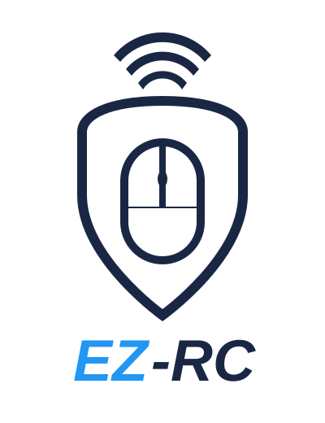

# Easy-RC (EZ-RC)



A MacOS (could potentially work on Linux and Windows, but I have not tested this) application that runs on your computer and allows your phone or any other device with a browser to connect and control the mouse.

## Prerequisites
- Golang version v1.25 - https://go.dev/dl/
  - Using a version manager such as goenv is recommended - https://github.com/go-nv/goenv
- Protobuf compiler - https://protobuf.dev/installation/
- `protoc-gen-go` - Go code generator plugin for protobuf
- NodeJS v24.12.0 - https://nodejs.org/en/download
  - Using a version manager such as nvm is recommended - https://github.com/nvm-sh/nvm

### Setting up Go with goenv

1. Install goenv: https://github.com/go-nv/goenv#installation
2. Install and activate the required Go version:
   ```bash
   goenv install 1.25.5
   goenv global 1.25.5   # or `goenv local 1.25.5` inside this repo
   ```
3. Ensure `$(go env GOPATH)/bin` is on your PATH. Add this to your shell profile (`.zshrc`, `.bashrc`, etc.):
   ```bash
   export PATH="$(go env GOPATH)/bin:$PATH"
   ```
4. Install the protobuf Go plugin:
   ```bash
   go install google.golang.org/protobuf/cmd/protoc-gen-go@latest
   ```


## Server
- Go application with an http connection which will serve the client js code
- Web socket connection for the js client to talk to in order to issue commands for the server to read and execute on the machine
- The server will provide all instructions to the client how it can find the specific instance of the device (which ip address and port to connect to)

## Client
- Basic JS application that acts as a remote from your mobile device to your server

## Common
- Shared protobuf model for the client and server to communicate with one another

# Scripts

All scripts are in the `scripts/` directory and can be run from any working directory.

### Top-level

| Script | Description |
|--------|-------------|
| `scripts/build.sh` | Full production build — runs client build, copies dist into server, then runs server build |

### Client (`scripts/client/`)

| Script | Description |
|--------|-------------|
| `client-install.sh` | Install client dependencies (`npm ci`) |
| `client-proto.sh` | Generate TypeScript protobuf stubs |
| `client-compile.sh` | Compile client code |
| `client-lint.sh` | Lint client code |
| `client-test.sh` | Run client tests |
| `client-copy-into-server.sh` | Copy compiled client dist into `server/static/` |
| `client-full-build.sh` | Full client pipeline: install, proto, compile, lint, test |

### Server (`scripts/server/`)

| Script | Description |
|--------|-------------|
| `server-proto.sh` | Generate Go protobuf stubs |
| `server-compile.sh` | Build production binary to `server/bin/easy-rc` |
| `server-compile-dev.sh` | Build debug binary (with debug tag) to `server/bin/easy-rc` |
| `server-lint.sh` | Lint server code (`go vet`) |
| `server-test.sh` | Run server tests |
| `server-full-build.sh` | Full server pipeline: proto, compile, lint, test |

# Running

## Server
- Development: `./scripts/server/server-compile-dev.sh && ./server/bin/easy-rc`
- Production: `./scripts/build.sh && ./server/bin/easy-rc`

You should see an `RC` icon in the status bar. Click it → Click show QR code → Scan the QR code with the camera on your phone. Now you should be able to control the computer with your phone.

## TODO list
- [x] Migrate from the custom-built protocol to the protobuf schema
- [x] Migrate the code (merge client) into a monorepo to easier share the protobuf models
- [x] Create QR code/ simple way for client to connect - https://github.com/caseymrm/menuet
- [x] Refactor server to have the websocket be decoupled from the command processing so it can be tested
- [x] Create scripts that build & run the applications all at once
- [x] Get CI/CD pipeline working in github actions
- [ ] Implement double clicking
- [ ] Implement clicking on the touchpad instead of relying on the buttons
- [ ] Fix reconnection bug after refreshing the browser it doesn't reconnect straight away
- [ ] Rewrite client to some frontend framework. Getting quite tiresome manually managing the state even though it is small 
